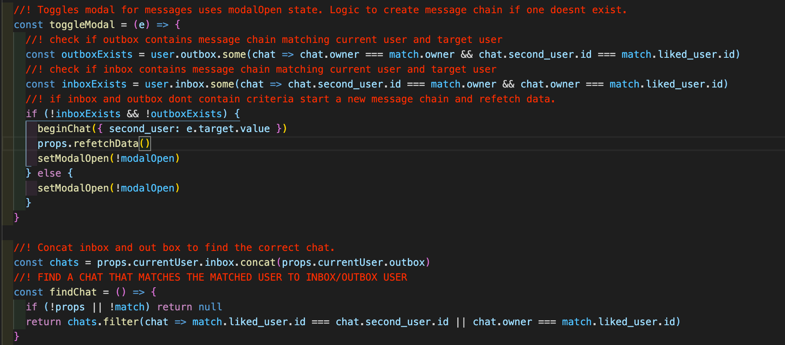

# SEI Project four: Blind Dates

## Link goes here

## **Overview**

Project 4 was a return back to a solo project for me. Our brief was to create a full stack app using **Python** and **Django** for the backend and **React** on front end. Initially I made the decision to do a dating app, then, whilst building the back end the idea evolved into creating a dating app that focused on opinions rather than aesthetics. I decided to do a tinder style app but instead of swiping on images of users you swipe on information about a person you dont see. If users opinions align they can unlock the users profile picture, potentially match and chat. 

I began by laying out a rough backend drawing out views and models I thought would be required to make a dating app.

------------------------------

## **Brief.**

#### Project Brief:

* **Build a full-stack application** by making your own backend and your own front-end
* **Use a Python Django API** using Django REST Framework to serve your data from a Postgres database
* **Consume your API with a separate front-end** built with React
* **Be a complete product** which most likely means multiple relationships and CRUD functionality for at least a couple of models
* **Implement thoughtful user stories/wireframes** that are significant enough to help you know which features are core MVP and which you can cut
* **Have a visually impressive design** to kick your portfolio up a notch and have something to wow future clients & employers. **ALLOW** time for this.
* **Be deployed online** so it's publicly accessible.
* **React Hooks** is optional for this project

------------------------------

## **Technologies used.**

### Backend: 

* **Python**
* **Django Rest Framework**
* Postgres
* Pyjwt
* psycopg2

### Frontend:

* **React Hooks**
* Axios
* React-router-dom
* Bootstrap (for Carousel)
* React-swipable
* Http-proxy-middleware
* React notify toast

### Development tools.

* VS code
* Yarn
* Insomnia
* TablePlus
* Git
* Github
* Google Chrome dev tools
* Eslint linter
* Pylint 
* Heroku
* Miro Board

------------------------------

## **Approach**

### Back End.

In the planning stages I identified that the backend for *Blind dates* would be relatively small. The majority of focus would be primarily on a user model along side models for liking/disliking users and messaging. 

Firstly, I identified that the best way to acquire the gender and gender preference of a user would be to use enum fields to ensure that only specific options were available. I could then use this to make comparisons to filter users later. We had not touched on this in class so I had to do some research, the syntax was different and a bit dramatic compared to my previous experience with node.js on project 3. However in the end it proved to have been a useful decision.  

Using *Django* and *Python* I began by creating authentication views alongside relevant *list* and *detail* views to form a base of *CRUD* actions. I then used numerous many to one models for likes, dislikes and many to one to a many to one relationship to create messaging, an initial message chain using foreign keys for the current user and a target user to generate an id. Once a thread was created, I could then add replies to generate a one to one chat. 

## Front End.

### Working with React Hooks, Swipable and Bootstrap:

As seen in the project brief we were offered the oppotunity to use React hooks, a syntax that my class has had very limited time to familiarize ourselves with. I decided early on to challenge myself and attempt to build the entire app in hooks. I'm glad i did as, for the most part, React hooks is a very enjoyable solution to previous versions of React I have used. 

I also decided to adopt a mobile first approach to front end. This influenced my decision to implement swipe interactivity on my app to mimic a 'Tinder style' approach to dating apps. I achieved this my installing React-swipable and Bootstrap. Whilst researching the best way to achieve my goal I discovered Bootstrap's Carousel feature and React-swipable. These both had very helpful documentation and were easy to use.

### Logic:

I vastly underestimated the amount of logic in even a basic dating app. There were too main pieces of logic to consider. The first essential piece of logic was a filtering system to pair with the Bootstrap carousel. Firstly I had to move through each user and make a comparison between the current user's gender preference and all other user's genders. After this i used the models and views created on the back end to post into the liked or disliked lists using the React-swipable technology mentioned above. I then concatenated the liked and disliked lists together and filtered through all the users returning only those that do not appear in either list. This left me with an array that i could map and pass to the Bootstrap carousel to present the user with the unseen users.

The second compenent containing essential logic was the user dashboard. There, I took all users that the current user has liked and compared them to a seperate list on the current user which supplied anything users who have liked the current user. This logic could then be used to display any matched users. This then passes each matched user, via a map function, down to a child compenet which handles further logic. 

On the liked component I then created a function to handle a modal to display the message. I decided this was the best place to create the message chain. I firstly defined two consts that used a some function to return a boolean to check if the inbox or outbox contained a combination of the current and target user. Using this i could then use an if statement to send a post request to create a message train where neccisary. I then used some logic to concatenate the inbox and outbox and locate the chat to display. I then called this function and send the infomation down to the message component to display. 

### Styling:

Another decision I made on this project was to avoid using bulma and rely more on my styling ability. I wanted to focus on mobile first then adapt the desktop. I learnt on a few occasions in this that sometimes bulma and its classes can be very helpful for things like modals and form rejection responses. These were simple to rectify and for me a small price to pay rather than battling bulma's styling.

------------------------------

## **Bugs.**

I haven't found any bugs for now. There are a number of small things that bother me however I don't they can be helped. Purely down to the way the page reloads and returns the page to the top.

------------------------------

## **Wins and Hurdles.**

#### Wins: 

This project was the trickiest to date. We had two weeks to become familiar enough with python, django and postgres. The SQL approach to back end was quite different to what I had become accustomed to in MongoDB and node.js. Getting to grips with relationships between tables was a big win for me as it didn't come naturally at first.

Another big win for me was using react hooks throughout the app after only two lessons on the syntax. At first it was quite tricky getting to grips with useEffect and its tracking syntax. This at first seemed convoluted in comparison to componentDidMount etc in previous React syntaxes. 

The biggest win and probably the most satisfying part of making this app for me was the logic. I enjoyed console logging my way through and solving issues to make the app as functional as possible. 

#### Hurdles:

As mentioned in wins adapting to python, django and postgres with minimal experience and knowledge was a big hurdle to over come. It took alot of trial and error to get my head around certain aspects of django. Adapting basic CRUD functions to meet the apps needs was much trickier than I expected, fortunately I had planned ahead for setbacks on back end and halted progress didnt impact my over all time management. 

------------------------------

