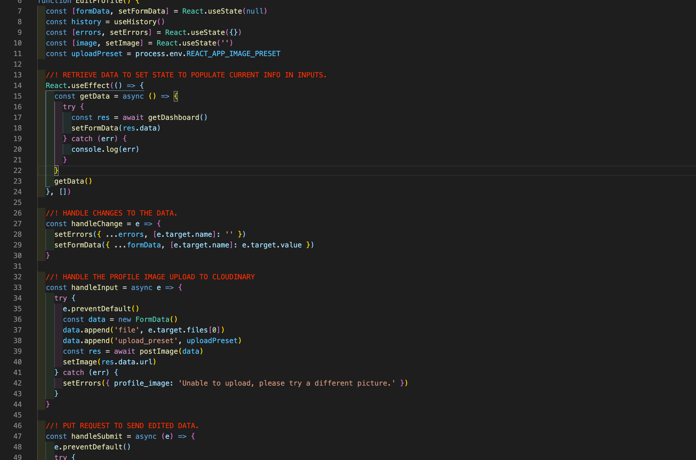
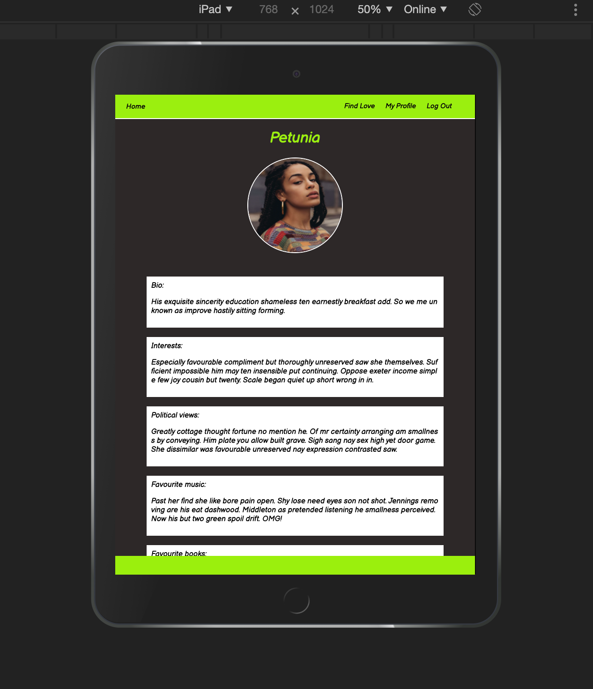

# SEI Project four: Blind Dates

## https://blind-dates.herokuapp.com/

## **Overview**

Project 4 was a return back to a solo project for me. Our brief was to create a full stack app using **Python** and **Django** for the backend and **React** on the front end. Initially, I made the decision to develop a *dating app*, then, whilst building the back end the idea evolved into creating a dating app that focused on opinions rather than aesthetics. I decided to do a *Tinder style* app but instead of swiping on images of users, you swipe on opinions and facts about a person. If users' opinions and lifestyles align they can unlock the users' profile picture, potentially match and chat. 

I began by laying out a rough backend design board out views and models that I thought would be required to make a dating app. This preparation served me well and helped me visualise and stay on track. 

------------------------------

## **Brief.**

#### Project Brief:

* **Build a full-stack application** by making your own backend and your own front-end
* **Use a Python Django API** using Django REST Framework to serve your data from a Postgres database
* **Consume your API with a separate front-end** built with React
* **Be a complete product** which most likely means multiple relationships and CRUD functionality for at least a couple of models
* **Implement thoughtful user stories/wireframes** that are significant enough to help you know which features are core MVP and which you can cut
* **Have a visually impressive design** to kick your portfolio up a notch and have something to wow future clients & employers. **ALLOW** time for this.
* **Be deployed online** so it's publicly accessible.
* **React Hooks** is optional for this project

------------------------------

## **Technologies used.**

### Backend: 

* **Python**
* **Django Rest Framework**
* Postgres
* Pyjwt
* psycopg2

### Frontend:

* **React Hooks**
* Axios
* React-router-dom
* Bootstrap (for Carousel)
* React-swipeable
* Http-proxy-middleware
* React notify toast
* SCSS

### Development tools.

* VS code
* Yarn
* Insomnia
* TablePlus
* Git
* Github
* Google Chrome dev tools
* Eslint linter
* Pylint 
* Heroku
* Miro Board

------------------------------

## **Approach**

### Back End.

In the planning stages I identified that the backend for *Blind dates* would be relatively small. The majority of focus would be primarily on a large *user model* alongside models for liking/disliking users and messaging. 

Firstly, I identified that the best way to acquire the gender and gender preference of a user would be to use **enum fields** to ensure that only specific options were available. I could then use this to make comparisons to filter users on the front end. We had not touched on *enum fields* in class so I had to do some research, the syntax was different and a bit more involved than my previous experience with *node.js* on *Project 3*. Researching and learning to use *enum fields* was a worthwhile use of my time as it made creating comparisons on the front end much easier.   

Using **Django** and **Python** I began by creating authentication views alongside relevant *list* and *detail* views to form a base of *CRUD* actions. I then used numerous **many to one** relationships for likes, dislikes and *many to one* to a *many to one* relationship to create messaging, an initial message chain using foreign keys for the current user and a target user to generate an id. Once a thread was created, I could then add replies to generate a one to one chat. 

## Front End.

### Working with React Hooks, Swipable and Bootstrap:

As seen in the *Project brief* my class were offered the opportunity to use **React Hooks**, a syntax that we had limited opportunity to familiarize ourselves with. I decided early on to challenge myself and attempt to build the entire app in *Hooks*. Getting to work with *React Hooks* for the first time was an interesting and enjoyable experience.

I also decided to adopt a **mobile first** approach to building the front end. This influenced my decision to implement **swipe interactivity** to mimic a 'Tinder style' approach to dating apps. I achieved this by using **React-swipeable** and **Bootstrap**. Both *Bootstrap* and *React-Swipeable* had very easy to navigate documentation and were surprisingly easy to work with. *Swipeable*'s in built prevent default and *event listeners* made the ability to swipe very easy.

### Logic:

I *massively* underestimated the amount of logic in even a basic dating app. There were two main pieces of logic to consider. 

##### Filtering users to display:
The first essential piece of logic was a *filtering functionality* to supply the Bootstrap carousel with users. Firstly, I had to cycle through each user and make a comparison between the current user's gender preference and all other user's genders using a *filter method*. 

After this I used the models and views created on the back end to post into the **liked or disliked lists** using the *React-Swipeable* technology mentioned above. These lists were then *concatenated into an array* which I could then filter and return only users who haven't previously appeared to the current user. This left me with an array that I could map and pass to the *Bootstrap carousel* to present the user with only unseen users matching their gender preference.

##### Creating matches and messages: 
The second component containing essential logic was the *user dashboard*. There, I took all users that the current user has liked and compared them to users who liked them. This comparison could then be used to display any **matched** users. This then passes each matched user, via a map function, down to a child component to display matched users on the dashboard. 

Once the *matched variable* had been created I then used that to trigger the creation of a message chain between the matched users. I firstly defined two variables that used a *some method* to return a *boolean* to check if the *inbox* or *outbox* contained any cases of a combination of the current and matched user. Using this I could then use an *conditional statement* to send a post request to create a message chain, only if it doesn't already exist. In the **Liked Component** I then concatenated the inbox and outbox together and located the correct chat to display relevant to the user. I then called this function and sent the information down to the *message component* to display. 

### Styling:

Another decision I made on this project was to not use *bulma* and rely and improve on my styling ability. As previously mentioned I wanted to focus on mobile first then adapt my app to a desktop version. I learnt on a few occasions in this that sometimes bulma and its classes can be very helpful for things like modals and form error responses. These were simple to rectify and for me a small price to pay to have greater control in styling elsewhere in the app.

------------------------------

## **Bugs.**

I haven't found any bugs for now. There are a number of small things that bother me however I don't they can be helped. Purely down to the way the page reloads and returns the page to the top.

------------------------------

## **Wins and Hurdles.**

#### Wins: 

Project four was the trickiest to date. We had two weeks to become familiar enough with **Python**, **Django** and **Postgres**. The **SQL** approach was quite different to what I had become accustomed to in *MongoDB* and *Node.js*. Adapting to SQL relationships between tables was a big win for me as it didn't come naturally to me at first.

Another big win for me was using **React Hooks** throughout the app after only two lessons on the *syntax*. At first it was quite tricky getting to grips with *useEffect* and its *tracking changes* syntax. This at first seemed convoluted in comparison to *componentDidMount* etc in previous React syntaxes but I greatly enjoyed trying to adapt. 

The biggest win and probably the most satisfying part of making this app for me was the logic. I enjoyed console logging my way through and solving issues to make the app meet my personal specification. 

#### Hurdles:

As mentioned in wins adapting to *Python, Django and Postgres* with minimal experience and knowledge was a big hurdle to overcome. It took a lot of trial and error to get my head around deviating from Basic *CRUD* actions in Django. Manipulating incoming data to fit the apps' needs  was much trickier than I expected, fortunately I had planned ahead for setbacks on the back end so halted progress didn't impact my overall time management. 

------------------------------

## **Screenshots of the Project.**

